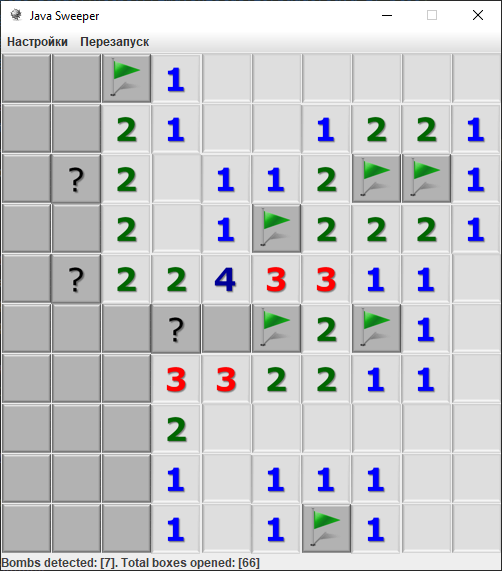
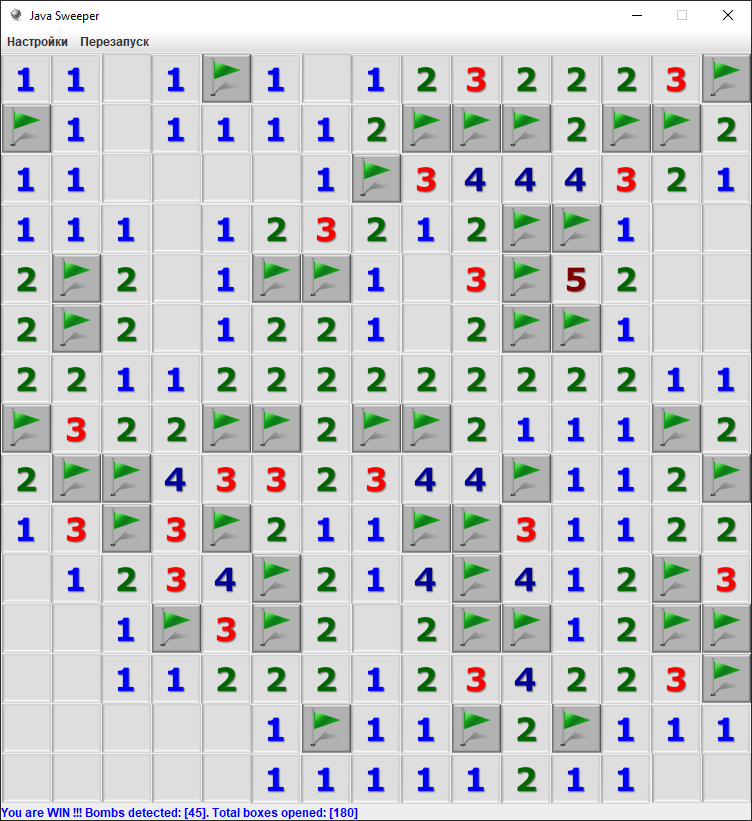
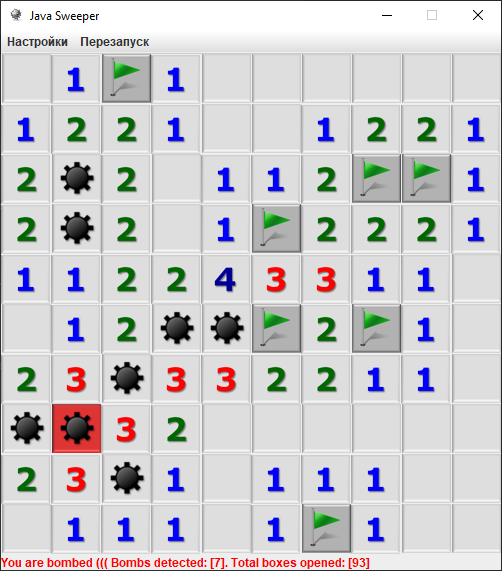

## Игра "Сапёр"
<picture align="center">
    
    
    
</picture>


### Описание
 - левая кнопка мыши: открыть ячейку
 - правая кнопка мыши: пометить ячейку
 - средняя кнопка мыши: перезапуск

### Настройки
 - `Фактор бомб: [0.1 - 1], default:[0.15]`
   - количество бомб вычисляется как: `[cols]*[rows]*[Фактор бомб]`

### Установка
```
git clone https://github.com/igojig/sweeper
```

### Запуск
```
mvn clean compile
mvn exec:java
```

### Примечание
В проекте используется `IntelliJ Designer Forms`, для корректной сборки добавлен соответствующий `Maven-plugin`