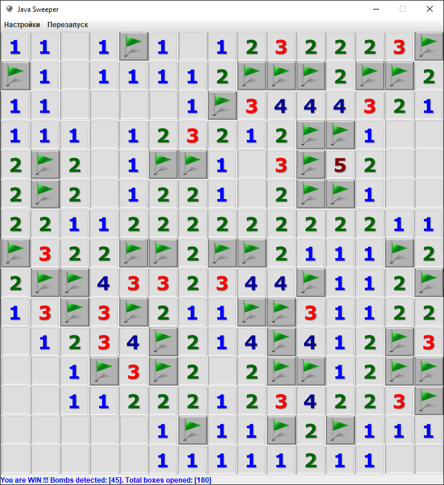

## Игра "Сапёр"


### Описание
 - левая кнопка мыши: открыть ячейку
 - правая кнопка мыши: пометить ячейку
 - средняя кнопка мыши: перезапуск

### Установка
```
git clone https://github.com/igojig/sweeper
```

### Запуск
```
mvn clean compile
mvn exec:java
```